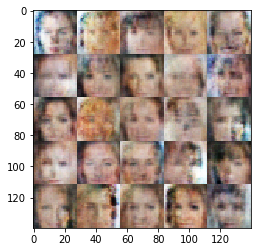

# DLND Face Generation

## Submission for Udacity Deep Learning Nanodegree Project 5

Implemented a Generative Adversarial Network, based on the DCGAN Model to generate new faces, using the [CelebFaces Attributes Dataset (CelebA)](http://mmlab.ie.cuhk.edu.hk/projects/CelebA.html) training dataset containing over 200,000 celebrity images.

### Sample Generated:
